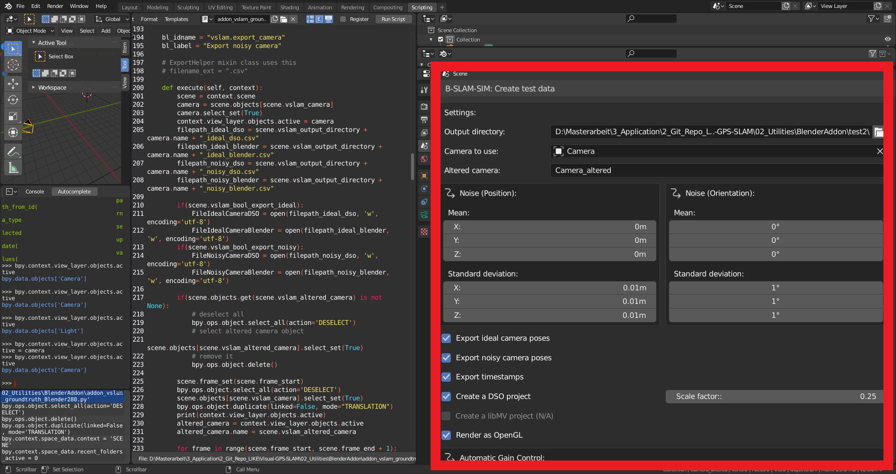
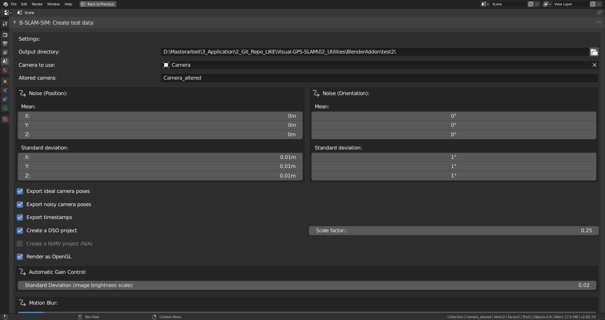
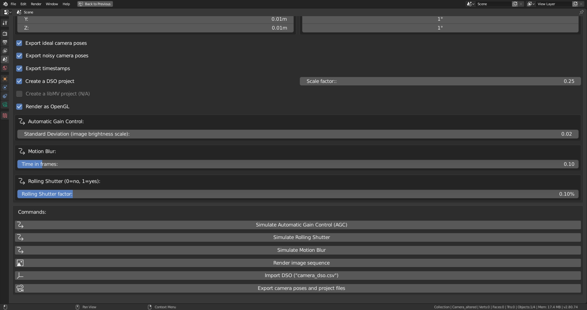

# Visual-GPS-SLAM
This is a repo for my master thesis research about the Fusion of Visual SLAM and GPS. It contains the thesis paper, code and other interesting data.

The website that accompanies this research can be found at:
https://Master.Kalisz.co

# Master Thesis
The Master Thesis was written in LaTeX and is published here:
http://master.kalisz.co/MasterThesis_AdamKalisz_Online.pdf

# Video
This video shows first tests with the setup running in a car:
[](https://master.kalisz.co/video/Robolab_Demo_Kalisz_MusicSTEEP.mp4)


# Publications
Three papers have been accepted and published related to this master thesis:

1. VISAPP 2020: "Systematic Comparison of ORB-SLAM2 and LDSO based on Varying Simulated Environmental Factors" by Adam Kalisz, Tong Ling, Florian Particke, Christian Hofmann, Jörn Thielecke. Link (VISAPP technical program): https://www.insticc.org/node/TechnicalProgram/visigrapp/2020/presentationDetails/88794
2. VISAPP 2019: "B-SLAM-SIM: A novel approach to evaluate the fusion of Visual SLAM and GPS by example of Direct Sparse Odometry and Blender" by Adam Kalisz, Florian Particke, Dominik Penk, Markus Hiller and Jörn Thielecke. Link (VISAPP technical program): http://insticc.org/node/TechnicalProgram/visigrapp/presentationDetails/73753
3. DICTA 2018: "Systematic Analysis of Direct Sparse Odometry" by Florian Particke, Adam Kalisz, Christian Hofmann, Markus Hiller, Henrik Bey and Jörn Thielecke. Link (IEEEXPLORE): https://ieeexplore.ieee.org/document/8615807

# Code
Code was written in C++ (main realtime implementation), Python (Blender Addon "B-SLAM-SIM" and Sensor data fusion in Blender), HTML5 (sensor recorder, track viewer, synchronization and live-demo tools).

This repository provides two tools that assist you evaluating your sensor data fusion approach.
Firstly, the data generation can be performed using the "B-SLAM-SIM" Addon (02_Utilities/BlenderAddon/addon_vslam_groundtruth_Blender2xx.py) in Blender.
Secondly, the generated data can be fused via the Linear Kalman Filter (02_Utilities/FusionLinearKalmanFilter/01_LinearKalmanFilter_allEvaluations.py) in Blender.

## Modifications to the original Code base of Direct Sparse Odometry (DSO)

This project heavily relies on using the Direct Sparse Odometry implementation by Engel et. al. (2016) (see Dependencies below). My project is not about the DSO, it is only used as an example for a VSLAM sensor to be used in a data fusion approach. Please note, that any suggested improvements to their codebase, will not be incoorporated into the original project, neither will they into my modifications. These are roughly my modifications to the original DSO code base:
* Exported the estimated trajectory in the output wrapper as csv files (see here: https://github.com/GSORF/Visual-GPS-SLAM/blob/master/03_Application/dso/src/IOWrapper/OutputWrapper/SampleOutputWrapper.h#L230)
* Imported camera poses from Blender (see here: https://github.com/GSORF/Visual-GPS-SLAM/blob/master/03_Application/dso/src/util/DatasetReader.h#L368)
* Tried to use the ground truth generated using Blender instead of the optimized camera poses: Did not work and I have no idea why! (see here: https://github.com/GSORF/Visual-GPS-SLAM/blob/master/03_Application/dso/src/FullSystem/FullSystem.cpp#L863)
* Upload of estimated trajectory and point cloud via a custom REST API to my webserver in real-time (see here: https://github.com/GSORF/Visual-GPS-SLAM/blob/master/03_Application/dso/src/IOWrapper/OutputWrapper/SampleOutputWrapper.h#L233)
* Simple implementation of a linear Kalman Filter for real-time sensor data fusion (see here: https://github.com/GSORF/Visual-GPS-SLAM/blob/master/03_Application/dso/src/FullSystem/FullSystem.cpp#L867)
* Drawing of (local) coordinate systems and world grid for better orientation as well as additional debug visualizations of the DSO+GPS-fused camera trajectory in the 3D Viewer Pangolin (see here: https://github.com/GSORF/Visual-GPS-SLAM/commit/566b38cb8a91d1724d407679f4b43fd47145ddbc#diff-8d512a7efc9da2929b5131d4209f19a6)

It turned out to be very hard for me to satisfactorily modify the almost 20.000 lines of code of the DSO to even accomplish something as easy as just replacing the optimization procedure with ideal camera poses from the synthetic Blender datasets. Even after two years (today is the 24th April 2020) there is no suggestion on how to do that on my StackOverflow question (see here: https://robotics.stackexchange.com/questions/15456/how-to-properly-initialize-every-new-pose-in-a-visual-slam-algorithm-namely-dso) (Update, May 21st 2020: A friendly user kindly explained the procedure to actually accomplish this: https://robotics.stackexchange.com/a/20609!). I therefore suppose that this is not trivial (for non-DSO authors at least...) and thus decided to not do the fusion online while the DSO is running, but rather as a post-processing approach in Blender, which I consider my main contribution on this topic as explained below.

## How to use the B-SLAM-SIM Blender Addon
The B-SLAM-SIM Addon helps you to generate datasets from within Blender for your evaluations. There is one version for the old Blender version 2.79 (02_Utilities/BlenderAddon/addon_vslam_groundtruth_Blender279.py) and the recent Blender version 2.80 (02_Utilities/BlenderAddon/addon_vslam_groundtruth_Blender280.py). The old Blenderversion will not be developed further, therefore please use the recent Blender version 2.80 addon if possible.

### Installation

The usual way to install addons in Blender is to choose the addon file from the user preferences. For a quicker way you may want to switch to the "Scripting" workspace in Blender 2.80, create a new text block in the text editor, paste in the content of the file 02_Utilities/BlenderAddon/addon_vslam_groundtruth_Blender280.py and click on "Run Script". You should then see a new Panel available in Blender in the Properties Window under "Scene" Settings.



### B-SLAM-SIM User Interface

The user interface is shown in the following two figures - this is the upper part:



and this is the lower part:



For a sample use case let us consider that we need to export the animated camera pose from Blender into a text file for general use. Due to the goal of this work to further process this information in the Direct Sparse Odometry (DSO) algorithm, the addon automatically transforms camera poses from Blenders' coordinate system to the coordinate system of the DSO. In case you need the camera pose in Blenders's coordinate system, the addon will create that for you as well. In order to export your camera, please follow these steps:
1. Select where you want to export the data by specifying the "Output directory:" in the addon
2. Select what camera you would like to export from the object list "Camera to use:" in the addon
3. (Optional) If noisy camera poses are needed: Specify the stochastic errors for noisy measurements and the name of the noisy camera object (setting: "Altered camera:")
4. Click on "Export camera poses and project files"

That was easy, wasn't it?! The generated ideal measurements might look similar to this:

```
0,0.000000,0.000000,2.663379,1.000000,0.000000,0.000000,0.000000
41,0.000000,0.000000,2.662659,1.000000,0.000000,0.000000,0.000000
83,0.000000,0.000000,2.660517,1.000000,0.000000,0.000000,0.000000
125,0.000000,0.000000,2.656981,1.000000,0.000000,0.000000,0.000000
166,0.000000,0.000000,2.652078,1.000000,0.000000,0.000000,0.000000
208,0.000000,0.000000,2.645836,1.000000,0.000000,0.000000,0.000000
250,0.000000,0.000000,2.638283,1.000000,0.000000,0.000000,0.000000
...
```

And the noisy measurements might look similar like this:

```
0,-0.002156,-2.663053,0.008892,0.711329,-0.702853,0.000177,-0.002924
41,0.002019,-2.662250,-0.002182,0.708399,-0.705806,-0.002386,-0.002000
83,0.000578,-2.645234,-0.010186,0.701929,-0.712188,0.008965,-0.001826
125,-0.014518,-2.652351,0.007760,0.709283,-0.704902,0.000696,0.005586
166,-0.002917,-2.646691,-0.008234,0.709311,-0.704700,-0.012817,-0.010529
208,0.003622,-2.634416,-0.014231,0.713894,-0.700067,0.016012,0.002503
250,0.017430,-2.632838,-0.001547,0.706452,-0.707607,-0.007457,-0.012700
...
```

The data is structured as follows:
```
Timestamp (optional, in milliseconds),Translation (x), Translation (y), Translation (z), Orientation Quaternion (w), Orientation Quaternion (x), Orientation Quaternion (y), Orientation Quaternion (z)
...
```


There are many more features in the addon that may help you generating datasets quickly. If you need assistance, please feel free to write me an issue on GitHub and I will explain the process in more detail.


## How to recreate the Plots from the thesis
In order to recreate the plots from the thesis and papers you can use the attached python script. First, make sure you are using Python3 and have "matplotlib" installed. For the latter you can usually do:
```bash
pip install matplotlib
```

This repository contains a larger amount of .txt files which have been generated in the sensor data fusion step within Blender. The location of those files is "02_Utilities/FusionLinearKalmanFilter" (the sensor data fusion script and a .blend file are located there as well!). These .txt files can be converted to plots using the following command:
```python
python BlenderPlot.py
```
If you want to test your own sensor data fusion, you can use the Blender 2.79 (no 2.8 at the moment) "01_LinearKalmanFilter_allEvaluations.blend" file in "02_Utilities/FusionLinearKalmanFilter" and take a look at how sensor data fusion is done there. Please, if you have any questions related to that, feel free to contact me or just open an issue. I will respond as soon as possible! I have planned to create a video tutorial on how to use it, but didn't manage to finish it yet. This is still on my TODO list and will most likely make everything a lot clearer.

## How to use the modified Direct Sparse Odometry (DSO) Code?

Please follow the [](https://github.com/JakobEngel/dso#2-installation). As of October, 06th, 2019 I had no issues to compile the code on a Jetson Nano embedded board. However, during my Master's thesis I had quite a few annoying compiler crashes (VTable Bugs with Gnu GCC):


At that time, I had fixed them with generating additional diagnosis data, which you can see in my bug report here: [](https://gcc.gnu.org/bugzilla/show_bug.cgi?id=82985). Maybe it will help you the same way as it did for me.

Once you have DSO compiled, you may want to copy my code (from "03_Application/dso") over the original one to get my modifications to the viewer (I am drawing the world grid, world axes and camera axes to help with coordinate system transformations), the DSO Code (I can import camera poses from Blender - however, fusing ground truth data did not work as expected still - and I export the camera poses in a wrapper. Furthermore I upload the cameraposes via HTTP via a POST request)

## How to use the modified Robot Operating System (ROS) DSO Wrapper?

Once again, please follow the [](https://github.com/JakobEngel/dso_ros) but be sure to checkout the "catkin" branch instead of the "master" branch using:
```bash
git checkout catkin
```
After this, compile using the following command in your catkin workspace (typically "~/catkin_ws": 
```bash
catkin_make
```
You may now copy my code (from "03_Application/dso_ros") over the original code in order to have my working code to operate the real-time DSO via ROS using a Stereolabs ZED Camera with their official ROS Wrapper (see [](https://github.com/stereolabs/zed-ros-wrapper)).

## Why GPLv3 license?
I have modified code that is licensed under GNU GPL Version 3 (see below), so I have to make my changes available under the same license. I can provide a different license for my custom Blender Addon scripts if you prefer that. Just feel free to message me.

## Dependencies
### Direct Sparse Odometry (DSO)
This work uses the Direct Sparse Odometry Project by TUM (see: https://vision.in.tum.de/dso and https://github.com/JakobEngel/dso). License: GPL-v3.

### Direct Sparse Odometry for ROS (ros-dso)
There is also a ros-wrapper for DSO, which is used for the real-time part of this work (see https://github.com/JakobEngel/dso_ros). The "catkin" branch by Nikolaus Demmel was actually used here, as the original "rosmake" version did not work for me. License: GPL-v3.
